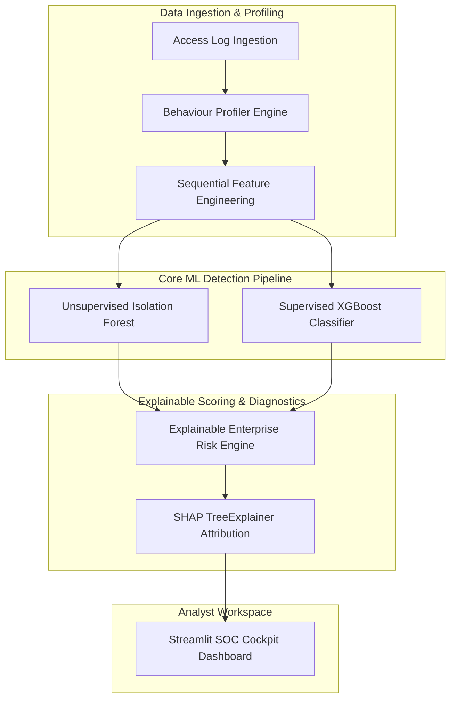

# 🛡️ AI-Powered Behavioral Anomaly Detection System (Honeywell SOC Cockpit)

A production-grade, explainable machine learning platform designed to identify cyber threats by learning normal user and device access patterns rather than relying on traditional static, signature-based security rules.

---

## 📋 Table of Contents
1. [Project Overview](#-project-overview)
2. [Problem Statement](#-problem-statement)
3. [Architecture Diagram](#-architecture-diagram)
4. [Technology Stack](#-technology-stack)
5. [Synthetic Data Generation](#-synthetic-data-generation)
6. [Behaviour Profiling](#-behaviour-profiling)
7. [Detection Pipeline](#-detection-pipeline)
8. [Attack Classification](#-attack-classification)
9. [Explainability Layer](#-explainability-layer)
10. [SOC Dashboard](#-soc-dashboard)
11. [Installation Guide](#-installation-guide)
12. [Usage Instructions](#-usage-instructions)
13. [Project Structure](#-project-structure)
14. [Future Enhancements](#-future-enhancements)

---

## 🔍 Project Overview
This repository implements a complete end-to-end cybersecurity solution for behavioral threat detection. Traditional security measures miss zero-day exploits, credential leaks, and insider threats because they scan for known indicators of compromise (IoCs). The Honeywell SOC Cockpit models behavioral telemetry per entity (users, service accounts, and edge devices), extracts dynamic sequential anomalies, computes risk scores (0–100), and provides full SHAP-based diagnostic explanations for Security Operations Center (SOC) analysts.

---

## ⚠️ Problem Statement
Modern enterprise networks demand behavioral security analytics that can:
1.  Detect complex, multi-stage attacks: **Credential Misuse, Brute Force, Lateral Movement, Impossible Travel, and Device Spoofing**.
2.  Maintain robustness against machine learning operational gaps: **Class Imbalance, Concept Drift, and Cold Start**.
3.  Deliver human-interpretable results: **Explainable Risk Scores** and interactive dashboards that explain *why* alerts are generated.

---

## 🏗️ Architecture Diagram



---

## 💻 Technology Stack
*   **Core**: Python 3.11
*   **Data Processing**: Pandas, NumPy
*   **Machine Learning**: Scikit-Learn, XGBoost, SHAP, Joblib
*   **Dashboard & Visuals**: Streamlit, Plotly
*   **Simulation & Testing**: Faker, Pytest

---

## 📊 Synthetic Data Generation
Located in `ml/generator.py`, the synthetic generator models over 500 distinct entities (Users, Service Accounts, Edge Devices) with unique baselines (frequent IPs, work hour distributions, allowed resource scopes, and browser signatures). It outputs over 25,000 chronological events containing:
*   **Normal Telemetry**: Realistic daily access events.
*   **Threat Injections**: Controlled anomaly scenarios modeling:
    *   *Brute Force / Credential Stuffing*: High-frequency failed login spikes.
    *   *Impossible Travel*: Rapid access from geographically distant IPs.
    *   *Lateral Movement*: Accessing sensitive resources outside of the entity's baseline profile scope.
    *   *Device Spoofing*: Access using mismatched User-Agent browser patterns.
    *   *Low-and-Slow Exfiltration*: Stealthy, periodic access to backup vaults.
    *   *Insider Drift*: Slow shift in daily working hours and accessed resources.
*   **Anomaly Constraint**: Maintained between 1% and 3% to model realistic, highly imbalanced enterprise networks.

---

## 👤 Behaviour Profiling
Located in `models/profiling_engine.py`, the engine compiles historical logs to build a dynamic baseline profile for each entity. It quantifies deviation scores for incoming logs across six dimensions:
1.  **Time Deviation**: Time differences relative to standard working hour bounds.
2.  **Device Novelty**: Probability of the browser fingerprint relative to preferred devices.
3.  **IP Novelty**: Novelty of the source IP.
4.  **Country Novelty**: Geographic country deviations.
5.  **Resource Scope Novelty**: Access to unrecognized, out-of-scope resources.
6.  **Session Duration Deviation**: Deviation in duration compared to the entity's baseline stats.

---

## ⚡ Detection Pipeline
The pipeline combines unsupervised and supervised layers:
*   **Unsupervised Layer (`models/anomaly_detector.py`)**: An `IsolationForest` model trained strictly on normal telemetry. It isolates zero-day anomalies and baseline deviations, outputting prediction status, anomaly scores, and distance-based confidence.
*   **Supervised Layer (`models/classifier.py`)**: A cost-sensitive multi-class `XGBoost` model that classifies anomalies into their respective Honeywell attack categories.

---

## 🚨 Attack Classification
The system classifies anomalous events into the following target classes:
*   **Normal**: Benign events matching baseline profiles.
*   **Brute Force**: Injects multiple authentication failures before success or lock.
*   **Credential Stuffing**: High-velocity automated checks across multiple user accounts.
*   **Impossible Travel**: Sequential accesses where calculated travel velocity exceeds physical limits.
*   **Lateral Movement**: Rapid access attempts targeting unauthorized database resources.
*   **Device Spoofing**: Matching user credentials with unrecognized browser fingerprints.
*   **Low-and-Slow Exfiltration**: Stealthy data transfers.
*   **Insider Drift**: Baseline drift indicating potential rogue employee activity.

---

## 🧠 Explainability Layer
To ensure analyst trust:
*   **SHAP Feature Attribution (`models/explainer.py`)**: Computes feature importance contributions for classification decisions, indicating which engineered feature triggered the alert.
*   **Explainable Risk Scorer (`models/risk_scorer.py`)**: Integrates classifier confidence, Isolation Forest deviation margins, and resource sensitivity to output a score (0–100).
*   **Natural Language SOC Explanations**: Converts SHAP attributions and sequential lag metrics into plain-English reasons (e.g., *"Alert generated because: 8 login failures occurred; login location changed at an impossible speed of 1240.2 km/h"*).

---

## 🖥️ SOC Dashboard
An interactive Streamlit dashboard (`streamlit_app.py`) provides:
*   **Executive Overview**: Core KPIs, incident statistics, and threat distribution charts.
*   **Threat Monitoring**: The live ingestion stream queue. Selecting a row routes it to the investigation workspace.
*   **Behaviour Profiles**: Interactive baseline profile inspector.
*   **Incident Investigation**: Gauge indicators, prescribed business impacts, recommended SOC playbooks, SHAP bar charts, and travel vector maps.
*   **System Health & Drift**: Population Stability Index (PSI) tracking and drift injection controls.
*   **Executive Report**: Downloadable summary containing operational metrics and model specifications.

---

## 🚦 Installation Guide

### Prerequisites
*   Python 3.11.x
*   PIP (Python Package Installer)

### Installation Steps
1.  **Clone the Repository**:
    ```bash
    git clone https://github.com/your-username/honey-well.git
    cd honey-well
    ```
2.  **Initialize Virtual Environment**:
    ```bash
    python -m venv venv
    .\venv\Scripts\activate
    ```
3.  **Install Required Libraries**:
    ```bash
    pip install -r requirements.txt
    ```

---

## 📖 Usage Instructions

### 1. Model Training & Validation
Run the full offline training pipeline to generate synthetic data, compile profiles, train the detection models, and output accuracy reports:
```bash
$env:PYTHONPATH="."
python -m ml.train
```

### 2. Launching the Streamlit SOC Cockpit
Start the interactive dashboard:
```bash
streamlit run streamlit_app.py
```
Open your browser and navigate to [http://localhost:8501](http://localhost:8501).

### 3. Running Unit Tests
Verify all system features and pipeline operations:
```bash
$env:PYTHONPATH="."
pytest
```

---

## 📁 Project Structure
```text
honey-well/
├── config/
│   └── settings.py          # Configuration settings, thresholds, and weights
├── data/
│   ├── access_logs.csv      # Generated access log database (25,000+ entries)
│   └── training_features.csv
├── ml/
│   ├── generator.py         # Log generation and attack injection engine
│   ├── dataset.py           # Feature engineering pipeline
│   ├── train.py             # Model training coordinator
│   └── evaluate.py          # Benchmark metrics evaluator
├── models/
│   ├── profiling_engine.py  # Profiles database with Cold Start and Drift EMA
│   ├── anomaly_detector.py  # Isolation Forest unsupervised detector
│   ├── classifier.py        # Cost-sensitive XGBoost classifier
│   ├── classification_engine.py # Unified classification wrapper
│   ├── risk_scorer.py       # Explainable Risk Engine
│   └── explainer.py         # SHAP explanation builder
├── tests/
│   └── test_pipeline.py     # Automated testing suite
├── README.md                # Project documentation
└── streamlit_app.py         # Streamlit dashboard
```

---

## 🚀 Future Enhancements
*   **Active Feedback Loop**: Implement "Resolve as Legitimate" buttons in the SOC console to dynamically update behavioral profiles, decreasing future false positive rates.
*   **Graph-Neural Networks (GNN)**: Model relations between users, devices, and shared resources to detect complex distributed lateral movements.
*   **Real-time Stream Ingestion**: Connect the pipeline to live SIEM databases (like Splunk or Elastic) via Kafka/Logstash.
